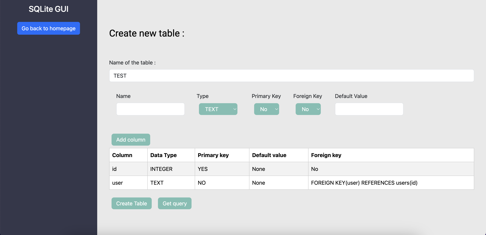

# SQLite GUI for Node.js Apps

[](https://www.npmjs.com/package/sqlite-gui-node)
[](https://www.npmjs.com/package/sqlite-gui-node)

<!--- [](https://github.com/AzouKr/sqlite-gui-node/actions/workflows/ci.yml)--->
<!---[](https://coveralls.io/github/AzouKr/sqlite-gui-node?branch=main)--->

[](https://nodei.co/npm/sqlite-gui-node/)

- [Installation](#installation)
- [Using a Custom Port](#using-a-custom-port)
- [Arguments](#arguments)
- [Updating the Package](#updating-the-package)
- [Uninstallation](#uninstallation)
- [Screenshots](#screenshots)

## Installation

To use `sqlite-gui-node`, you need to have Node.js installed on your machine. You can download Node.js from [nodejs.org](https://nodejs.org/en).

### Step 1: Install the Package

You can install `sqlite-gui-node` using npm (Node Package Manager). Run the following command in your terminal:

```
$ npm install sqlite-gui-node
```

### Step 2: Import and Initialize

After installing the package, you can import it in your index file of your project.

```js
// import the SQLite DB that you use
const sqlite3 = require("sqlite3").verbose();
const db = new sqlite3.Database("app.db");
// Import the package
const SqliteGuiNode = require('sqlite-gui-node');

...

// use the GUI
SqliteGuiNode(db).catch((err) => {
  console.error("Error starting the server:", err);
});

// Start the server and listen on the specified port
server.listen(port, () => {
  logger.info(`Server is running on ${port}`);
});

```

### Step 3: Access the GUI

Once the GUI is started, you can access it via a web browser. By default, it runs on http://localhost:8080. Open your browser and navigate to this URL to start performing CRUD operations on your SQLite database.

## Using a Custom Port

If you want to use a specific port, you can pass it as the second argument when initializing sqlite-gui-node:

```js
// Pass the port as the second argument
SqliteGuiNode(db, 3005).catch((err) => {
  console.error("Error starting the server:", err);
});
```

## Arguments

| Argument | Type               | Description                                                              |
| -------- | ------------------ | ------------------------------------------------------------------------ |
| db       | `sqlite3.Database` | The file of your SQLite database.                                        |
| port     | number             | (Optional) The port on which the GUI server will run. Default is `8080`. |

## Updating the Package

To update `sqlite-gui-node` to the latest version, you can run:

```
$ npm update sqlite-gui-node
```

## Uninstallation

If you need to uninstall sqlite-gui-node, you can do so by running:

```
$ npm uninstall sqlite-gui-node
```

## Screenshots





## Troubleshooting

If you encounter any issues during installation or usage, please refer to the Issues section on GitHub.

## License

The MIT License © 2024-present KERIM Abdelmouiz. All rights reserved.

---

Made with ♥ by [KERIM Abdelmouiz](https://github.com/AzouKr)
